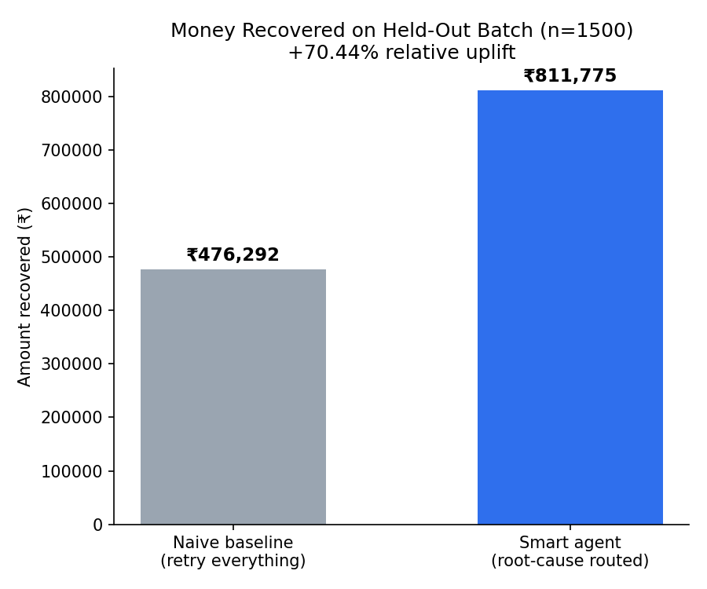
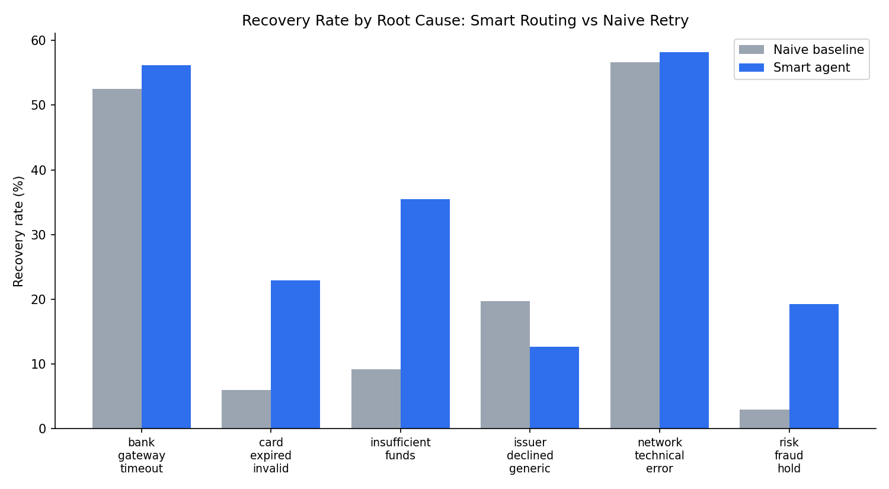
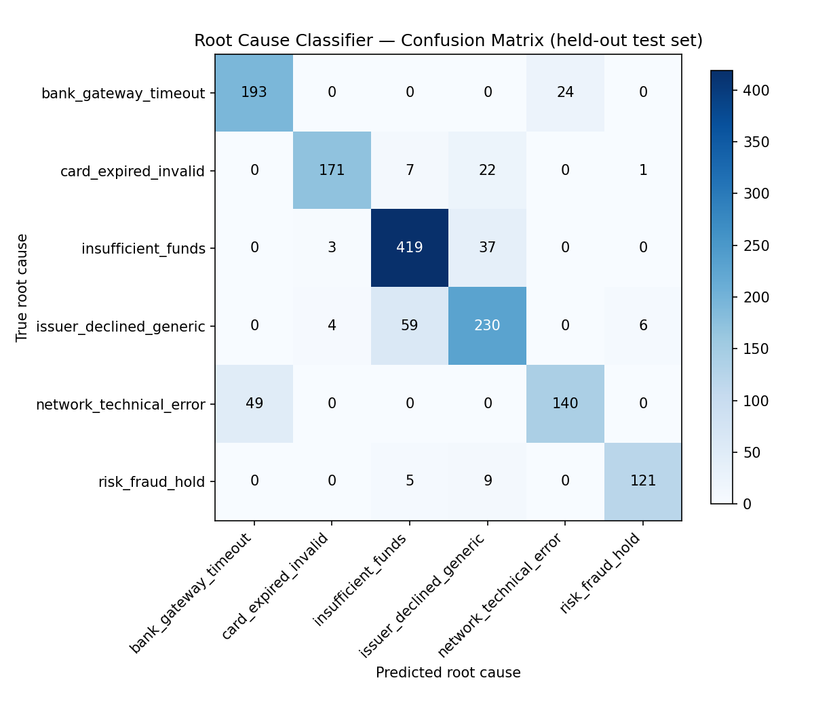
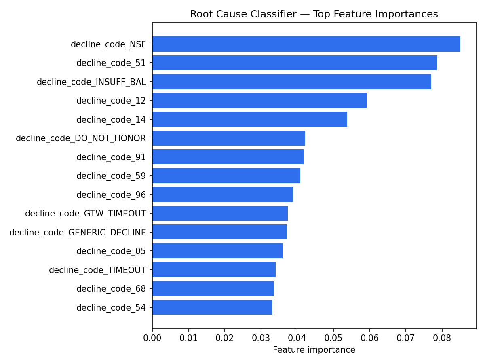

# Payment Degradation → Root Cause → Recovery Action

**Razorpay AI Buildathon 2026 — Track 03: AI Revenue Recovery**

An agent that detects failed payments, diagnoses *why* they failed using a
trained classifier (not a lookup table), scores the right recovery action per
failure type, and executes a bounded, auditable recovery workflow — instead of
blindly retrying everything or nothing.

## The problem

Most systems handle a failed payment one of two ways: retry immediately and
hope, or do nothing. Neither is smart. A payment that failed for
"insufficient funds" should not be retried immediately (it'll fail again) — it
should be retried after the customer's likely next payday. A payment that
failed because of a risk hold should *never* be auto-retried — it needs human
escalation. Getting the intervention right, per failure type, is where the
money is.

## What this does

```
failed transaction
      │
      ▼
[1] Root-cause classifier  ──► predicts one of 6 causes + confidence
      │                         (insufficient_funds, card_expired_invalid,
      │                          bank_gateway_timeout, risk_fraud_hold,
      │                          issuer_declined_generic, network_technical_error)
      ▼
[2] Guardrail / stopping-rule layer
      │   - confidence < 0.45           → flag for manual review, no auto-action
      │   - risk_fraud_hold             → ALWAYS escalate, never auto-retry (compliance)
      │   - prior_failures_7d >= 4      → stop, flag for manual review (anti-abuse)
      ▼
[3] Action engine ──► delayed_retry / immediate_retry / card_update_nudge /
      │                manual_escalation / manual_review
      ▼
[4] Audit trail ──► every decision logged: predicted cause, confidence,
                     action taken, escalation reason, outcome
```

Every transaction in the batch gets a full audit row — nothing is a black box.

## Results (held-out test set, n = 1,500 failed transactions)

| | Naive baseline (retry everything, once, immediately) | Smart agent (this project) |
|---|---|---|
| **Amount recovered** | ₹476,292 | **₹811,775** |
| **Recovery rate** | 19.6% | **33.4%** |
| **Relative uplift** | — | **+70.4%** |



The uplift isn't uniform — and that's the point. The smart agent wins big on
categories where the *right* intervention differs sharply from "just retry
now" (insufficient_funds: 35.5% vs 9.2%; card_expired_invalid: 22.9% vs 6.0%),
and is roughly neutral or intentionally conservative elsewhere (risk_fraud_hold
recovers less automatically because those cases are deliberately routed to
human escalation instead of auto-retried, which is a compliance requirement,
not a modeling failure).



### Root-cause classifier quality

Overall accuracy: **84.9%**, macro F1: **0.85** across 6 classes (chance ≈ 17%).

| Root cause | Precision | Recall | F1 |
|---|---|---|---|
| bank_gateway_timeout | 0.80 | 0.89 | 0.84 |
| card_expired_invalid | 0.96 | 0.85 | 0.90 |
| insufficient_funds | 0.86 | 0.91 | 0.88 |
| issuer_declined_generic | 0.77 | 0.77 | 0.77 |
| network_technical_error | 0.85 | 0.74 | 0.79 |
| risk_fraud_hold | 0.95 | 0.90 | 0.92 |

`issuer_declined_generic` is deliberately the hardest class — in the
synthetic data, 30% of transactions draw their decline code from a *shared,
ambiguous* code pool (the same raw gateway code, e.g. `05`/`DO_NOT_HONOR`, is
issued by different banks for genuinely different underlying reasons). This
mirrors real gateway behavior and is why accuracy isn't 100% — a
100%-accuracy result here would mean the task was a disguised lookup table,
not a real classification problem.





## Guardrails & stopping rules (the "bounded" part)

- **Never auto-retry risk holds.** `risk_fraud_hold` predictions are always
  routed to manual escalation, regardless of confidence — this is a hard
  compliance rule, not a model decision.
- **Confidence floor.** Predictions below 0.45 confidence don't trigger an
  automated action; they're flagged for manual review instead of guessing.
- **Retry cap.** Transactions with 4+ prior failures in the last 7 days are
  routed to manual review rather than retried again — this is the anti-abuse
  stopping rule that prevents infinite retry loops.
- **Full audit trail.** Every transaction's predicted cause, confidence,
  action, escalation reason (if any), and outcome is logged to
  `outputs/audit_trail.csv`.

## Project structure

```
payment-recovery-agent/
├── src/
│   ├── generate_data.py       # synthetic failed-transaction dataset generator
│   ├── train_classifier.py    # root-cause classifier (GradientBoosting)
│   ├── recovery_engine.py     # action policy, guardrails, audit trail, baseline
│   ├── feature_importance.py  # model explainability
│   └── make_summary_chart.py  # headline comparison figures
├── data/
│   ├── failed_transactions.csv   # full synthetic dataset
│   └── test_predictions.csv      # held-out test set + model predictions
├── outputs/
│   ├── root_cause_model.pkl
│   ├── classification_report.json
│   ├── confusion_matrix.png
│   ├── feature_importance.png
│   ├── recovery_comparison.png
│   ├── recovery_by_cause.png
│   ├── audit_trail.csv           # smart agent, every decision
│   ├── baseline_outcomes.csv     # naive baseline, every decision
│   └── recovery_summary.json     # headline numbers
├── requirements.txt
├── run_pipeline.sh
└── README.md
```

## Running it

```bash
pip install -r requirements.txt
bash run_pipeline.sh
```

This regenerates the dataset, retrains the classifier, runs the recovery
engine + baseline, and rebuilds all figures — end to end, in under a minute.

## Design decisions & honest limitations

- **Why GradientBoosting, not a neural net or LLM?** Tabular data, < 10k rows,
  need per-class precision/recall and feature importances for this writeup.
  A heavier model would not improve accuracy here and would cost
  explainability.
- **Why is the data synthetic?** No production Razorpay data was available;
  the generator deliberately injects realistic ambiguity (overlapping decline
  codes, class-dependent noise) rather than a clean separable dataset, so the
  reported metrics reflect a genuine classification difficulty rather than a
  disguised lookup table.
- **What would break this in production?** The recovery-outcome simulation
  (used only to compute $-recovered) encodes assumptions about which action
  works best per root cause — in a real deployment this would need to be
  replaced with actual A/B-tested recovery rates per action, and the model
  would need retraining as gateway decline-code semantics drift over time.
- **Compliance note:** the `risk_fraud_hold` escalation-only rule and the
  retry cap are non-negotiable in the code (not just soft defaults) — this
  reflects the buildathon's "explainable, bounded and gated" requirement for
  every money-moving action.
